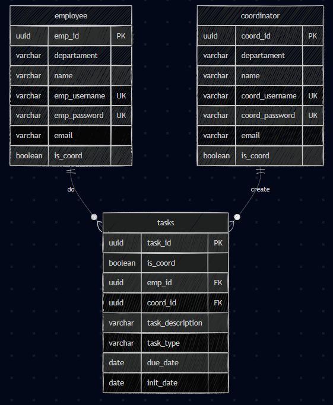

# <a name="c1"></a>1. Introdução

**Coordinator Task Manager - CTM** é uma aplicação web que consiste em um ambiente onde o coordenador pode gerenciar sua equipe e facilitar o controle e organização de tarefas diárias. O sistema permite que o coordenador crie novas tarefas e as atribua a um colaborador que desejar. 

O projeto é construído utilizando tecnologias modernas de desenvolvimento web, com uma arquitetura MVC (Model-View-Controller) dividida entre frontend e backend, e integra serviços de banco de dados de forma simples e escalável.

## Tecnologias Utilizadas:

- **Frontend:** HTML, CSS, JavaScript, EJS (template engine)
- **Backend:** Node.js com Express seguindo arquitetura MVC
- **Banco de Dados:** PostgreSQL

# <a name="c2"></a>2. Banco de Dados


<div align="center">
 <sub>Modelagem do Banco de Dados</sub><br><br>
 <br>
</div>


O sistema utiliza o PostgreSQL como SGBD. Todas as informações cadastradas ficarão armazenadas nesse banco de dados. A estrutura de dados foi projetada seguindo boas práticas de modelagem relacional para atender às funcionalidades do sistema de gerenciamento de tarefas, permitindo operações de leitura e escrita com desempenho e segurança.

## Estrutura das Tabelas

### Tabela `coordinator`

Armazena informações dos coordenadores no sistema.

### Tabela `employees`

Armazena informações dos colaboradores no sistema.

### Tabela `tasks`

Armazena informações das tarefas no sistema.

## Relacionamentos

- Um coordenador pode ter múltiplos colaboradores(1:N)
- Um colaborador pode ter múltiplas tarefas (1:N)

A integração com o banco de dados é feita através de queries SQL nativas no backend Node.js via módulo `pg`, garantindo acesso seguro e controlado aos dados.


# <a name="c4"></a>3. Integração Frontend e Backend

A aplicação utiliza uma arquitetura híbrida que combina renderização server-side com EJS e comunicação assíncrona via JavaScript para criar uma experiência de usuário moderna e responsiva.

## 4.1. Arquitetura da Integração

### Renderização Server-Side (EJS)

O sistema utiliza o template engine **EJS (Embedded JavaScript)** para renderizar as páginas principais:

```javascript
// Configuração do EJS no server.js
app.set('view engine', 'ejs');
app.set('views', path.join(__dirname, 'views'));

app.use(express.json());
app.use(express.static(path.join(__dirname, 'public')));
app.use("/", routes);

```

## 4.2. Fluxo de Dados

### 1. **Carregamento da Página**

```
Usuário acessa rota → Express Router → Controller → View EJS → HTML renderizado
```

## 4.3. Estrutura do Frontend

### Assets Estáticos

```
public/
├── css/
│   ├── styles.css          # Estilos globais
├── js/
│   ├── api.js           # Funções de comunicação com API
│   └── pages/
```

### Views EJS

```
views/
├── pages/
│   ├── employees.ejs    # Quadro de colaboradores
│   ├── home.ejs         # Tela principal
│   ├── tasks.ejs        # Gerenciamento de tarefas
├── partials/
│   ├── header.ejs       # Cabeçalho comum
│   ├── footer.ejs       # Rodapé comum
```

## 5. Frameworks e Tecnologias Escolhidas

### Backend

- **Node.js com Express:** Escolhido pela simplicidade na criação de APIs RESTful e pela vasta comunidade de suporte. O Express oferece flexibilidade para implementar a arquitetura MVC de forma clara e organizada.
- **PostgreSQL:** Selecionado como banco de dados pela robustez, confiabilidade e suporte nativo a relacionamentos complexos. A escolha de um banco relacional foi estratégica devido à natureza estruturada dos dados (usuários, projetos e tarefas) e suas interconexões.
- **Joi:** Implementado para validação de dados de entrada, garantindo integridade e segurança nas operações de CRUD. Oferece validações declarativas e mensagens de erro personalizáveis.

### Frontend

- **EJS (Embedded JavaScript):** Escolhido como template engine pela facilidade de integração com Node.js e pela capacidade de renderização server-side, reduzindo a complexidade do frontend inicial.
- **JavaScript Nativo:** Optou-se pelo uso do JavaScript, para manter o projeto leve e com o foco em seguir a curva de aprendizado do módulo.
- **CSS Customizado:** Desenvolvimento de estilos com tema azul para criar uma identidade visual.
- **Bootstrap:** Utilizado para criar funcionalidades visuais mais responsivas e agradáveis.

### Arquitetura

- **MVC (Model-View-Controller com melhorias):** Implementada para separar responsabilidades, facilitando manutenção e escalabilidade do código. Foi utilizada uma variação em que o model se desmembra em Repository e Model e o Controller em Service e Controller. Essa escolha foi para tornar o projeto mais escalável e de fácil manutenção.

# <a name="c6"></a>6. Aprendizados e Desafios

## 6.1. Principais Aprendizados Pessoais (Melhores compreendidos)

### Desenvolvimento Backend
- **Relacionamentos de Banco de Dados:** Implementação prática de relacionamentos 1:N (usuário-projetos, usuário-tarefas, projeto-tarefas) e suas implicações nas queries SQL.

### Desenvolvimento Frontend

- **Manipulação do DOM:** Técnicas de manipulação de elementos HTML dinamicamente, incluindo atualização de contadores e filtros em tempo real.

- **Design Responsivo:** Criação de interfaces adaptáveis e responsivas através de frameworks.

### Arquitetura e Padrões

- **Separação de Responsabilidades:** Compreensão prática da importância de separar lógica de negócio, apresentação e acesso a dados.

## 6.2. Desafios Pessoais 

### 1. Comunicação do frontend com o backend

**Desafio:** Conseguir manter todas as rotas e endpoints funcionais de modo que a aplicaçao funcione 100% em todas suas frentes. 

### 2. Manutenção de erros

**Desafio:** Identificar o que está causando o erro e como resolver o conflito.

---

# <a name="c7"></a>7. Análise de Resultados

## 7.1. Pontos que Funcionaram Bem

### Arquitetura e Estrutura

- **Separação clara de responsabilidades:** A arquitetura MVC facilitou a manutenção e permitiu desenvolvimento paralelo de diferentes camadas.

### Interface do Usuário

- **Design moderno e limpo:** Tema simples com interfaces sem poluição visual.

- **Responsividade efetiva:** Interface funciona bem em diferentes resoluções.

- **Feedback visual claro:** Indicadores de status, prioridades e loading que melhoram a experiência do usuário.

### Funcionalidades

- **CRUD (incompleto):** Quase todas as perações básicas implementadas com sucesso para coordenadores e tarefas.

## 7.2. Pontos para Melhoria

### Funcionalidades

- **CRUD de tarefas:** Implementar manutenção de tarefas, especificamente a atualização.
- **CRUD de colaboradores:** Implementar manutenção de colaboradores, especificamente a exclusão e a atualização.
- **Validação de coordenador:** Adicionar validação do usuário coordenador para trazer mais segurança.

## Conclusão

O desenvolvimento do Gerenciador de Tarefas proporcionou uma experiência complexa da criação de uma aplicação web do zero. Trouxe diversas dificuldades com a mudança de arquitetura em partes do projeto, mas trouxe bastante conhecimento desde o planejamento até a sua implementação prática. Apesar de incompleto, ajudou a compreender e entender melhor em quais partes do desenvolvimento de um software que tenho mais aptidão e caoacidade técnica.  